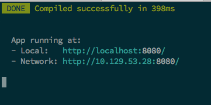
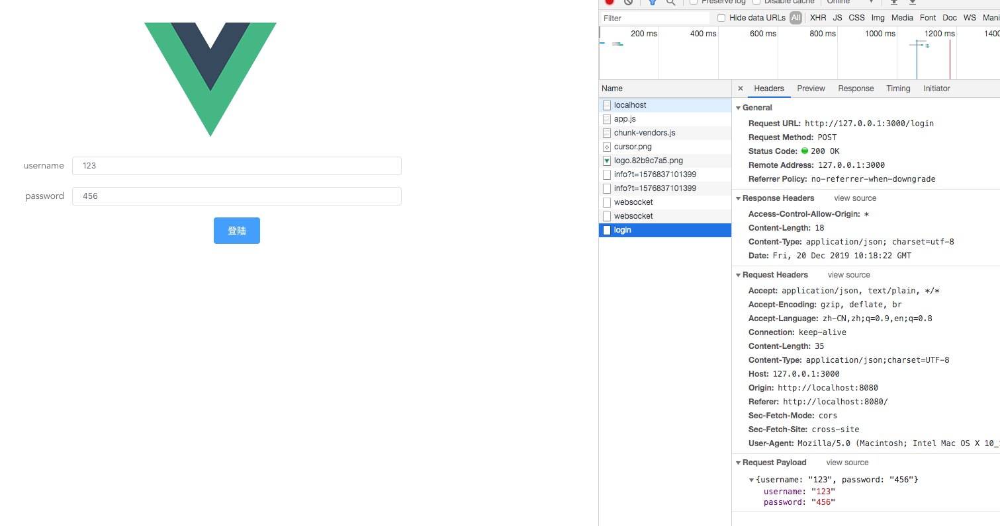
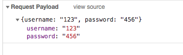
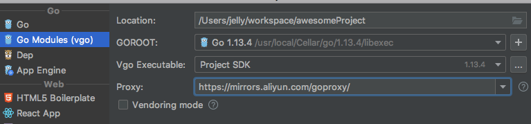
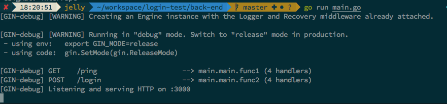
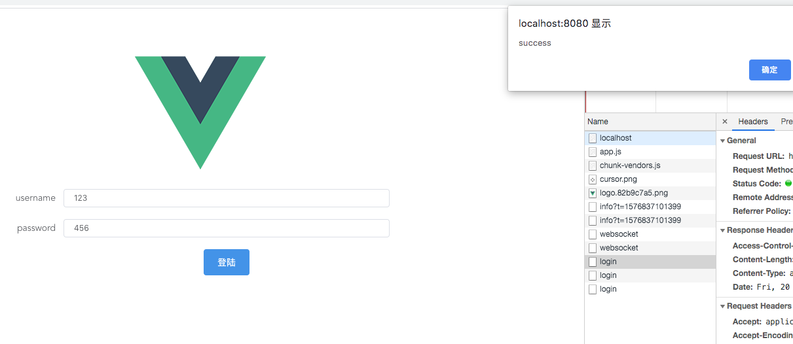
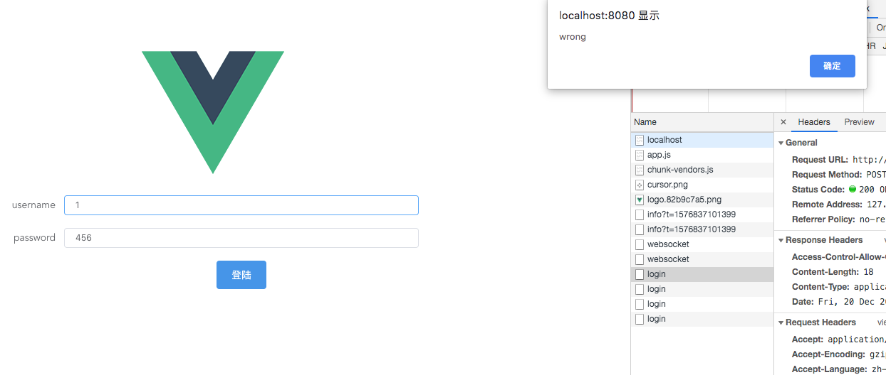

# 12-20 课堂测验

## front-end
- 前端使用vue，可以用脚手架生成一个最简易的项目

- ```bash
  vue create my-app
  ```

- 安装并使用element-ui组件

  ```bash
  npm i element-ui -S
  ```

  在main.js中加入以下语句全局启用element-ui

  ```javascript
  import ElementUI from 'element-ui';
  import 'element-ui/lib/theme-chalk/index.css';
  Vue.use(ElementUI)
  ```

- 将自带的HelloWorld.vue组件修改，加入element-ui的表单组件、输入框组件、按钮。

  ```javascript
  <template>
    <div class="hello">
      <el-form ref="form" :model="sizeForm" label-width="80px" size="mini">
        <el-form-item label="username">
          <el-input v-model="form.username"></el-input>
        </el-form-item>
        <el-form-item label="password">
          <el-input v-model="form.password"></el-input>
        </el-form-item>
        <el-form-item size="large">
          <el-button type="primary" @click="onSubmit">登陆</el-button>
        </el-form-item>
      </el-form>
    </div>
  </template>
  ```

- 安装axios并在HelloWorld的组件中引入axios：

  ```bash
  npm install axios
  ```

  HelloWord.vue:

  ```javascript
  import axios from "axios";
  const instance = axios.create({
    baseURL: "http://127.0.0.1:3000"
  });
  ```

  此处创建了一个instance实例并设置baseURL为本地的3000端口。

- 在data中添加表单中的变量，以及默认值

  ```javascript
  data() {
      return {
        form: {
          username: "123",
          password: "456"
        }
      };
    },
  ```

- 在methods中添加onSubmit函数，在按钮点击后会调用该函数。

  ```javascript
  methods: {
      onSubmit() {
        instance.post('/login',this.form)
          .then((response) => {
            alert(response.data.msg)
          })
          .catch((error) => {
            alert(error);
          });
      }
    }
  ```

  可以看到，onSubmit函数主要是通过instance来发起一个post请求，发送到baeURL + "login"地址，也就是127.0.0.1:3000/login地址。携带的数据为this.form，（会被自动转换为json）。若请求成功则会alert响应中的msg项。

- 至此，前端部分完成，使用以下语句启动服务器：

  ```bash
  npm run serve
  ```

  

  



点击登陆后可以看到页面发出了一个login请求至127.0.0.1:3000/login，携带的数据见右下方。



## back-end

- 首先新建一个空文件夹，使用以下语句声明为使用go mod管理的项目：

  ```bash
  go mod init my-back-end
  ```

  或者在golang创建时直接设置为go mod项目：(确保你的go sdk在12及以上)

  

  注意：Proxy要设置为国内镜像，可以用阿里云的：

  ```
  https://mirrors.aliyun.com/goproxy/
  ```

  使用命令行的话可以这样设置proxy地址：

  ```bash
  export GOPROXY=https://goproxy.io 
  ```

  这是另一个可以用的镜像。不用镜像会导致go mod一直下不下来依赖。

- 创建一个main.go文件，导入需要使用的包：gin和cors，然后使用命令自动下载依赖：

  ```go
  import (
  	"github.com/gin-gonic/gin"
  	"github.com/gin-contrib/cors"
  )
  ```

  ```bash
  go mod tidy
  ```

  go mod tidy 会自动检测项目中缺失的依赖，删除没用的依赖。

  这里会自动下载我们缺少的gin 和 cors。

- 在func main() 函数中加入以下语句：

  ```go
  r := gin.Default()  // 创建一个默认的gin路由
  r.Use(cors.Default()) // 为该路由设置默认的跨域规则，即允许所有跨域请求
  ```

- 为了接受post请求传送过来的json，需要先创建一个结构体：

  ```go
  type User struct {
  	Username string `form:"username" json:"username" binding:"required"`
  	Password string `form:"username" json:"password" binding:"required"`
  }
  ```

  这里有一个gin的坑，结构体中的字段必须大写开头，否则成功绑定后但是获取不到数据。

  右侧则表示绑定不同类型的数据时寻找的参数。

  譬如Username在绑定json时寻找该json中的username字段，右侧required表示该字段必须要绑定，否则error。

- 在r路由上开辟"/login"接口，并写相应的逻辑函数：

  ```go
  r.POST("/login",func(c *gin.Context){
  		var u User  // 空对象
  		if err:= c.BindJSON(&u); err!=nil{  //将请求中的数据绑定到u ， err存储可能出现的error 
  			c.JSON(200,gin.H{
  				"msg":"param error", // 如果有error则设置返回的msg为param error
  			})
  			return
  		}
    
    // 程序到这里表示绑定json数据成功了，开始业务逻辑
  		if u.Username == "123" && u.Password == "456" {
  			c.JSON(200,gin.H{
  				"msg":"success",
  			})
  		} else{
  			c.JSON(200,gin.H{
  				"msg":"wrong",
  			})
  		}
  	})
  ```

- 设置路由的启动，并设置端口：

  ```go
  r.Run(":3000")
  ```

- 运行main.go即可启动服务器：

  

- 前后端都开启后进行测试：

  

  

  

